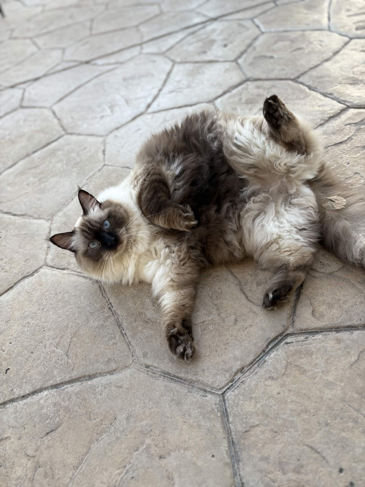

# Kaitlyn's CSE 110 User Page
## About Me
I really like chocolate, *particularly* milk chocolate. You're probably reading this and thinking, "Oh, that's normal." 

You'd be wrong.

Let me quote what a friend told me after I told him that I may or may not have ate almost an entire Tony's Chocoloney milk chocolate bar in one sitting: 
> "You have a problem."

You may not know how dense that chocolate bar is. I will provide an image for reference.
[Image of Tony's Chocoloney](chocolate.jpg)

If I
```
git add .
git commit -m "ate chocolate bar"
git push
```
to my caloric intake in chocolate that day, it would've amounted to 640 to 800 calories. So, I ate **over half** of my calories that day in chocolate. 

Slave labor is a major issue in the chocolate industry. As a chocolate ~~addict~~ lover, I prefer chocolate that is ethically sourced! 

Here is an [article](https://greenamerica.org/end-child-labor-cocoa/chocolate-scorecard) on how ethical certain chocolate brands are. If you like chocolate like me, you should consider supporting more ethical companies too!

Oh, and I also **love** cats (and mofusand!). I have a mofusand named Kuma.


